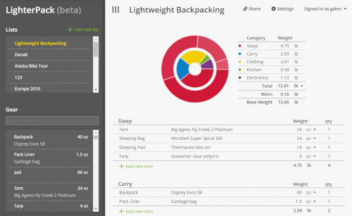

# LighterPack

**LighterPack helps you track the gear you bring on adventures.**

## Table of Contents

- [Description](#description)
- **For End Users**
  - [Where to View on the Web](#where-to-view-on-the-web)
  - [Usage and Screenshots](#usage-and-screenshots)
- **For Developers**
  - [Future Improvements](#future-improvements)
  - [Installation Instructions](#installation-instructions)
  - [Technologies Used](#technologies-used)
  - [Dependencies and Credits](#dependencies-and-credits)
  - [Project Structure](#project-structure)

## Description

Lighterpack allows you to track your detailed pack weights. It is useful for both hiking and travel and helps to visualize your pack's weight so you can more effectively reduce it.

## Where to View on The Web

[lighterpack.com](https://lighterpack.com/)

## Usage and Screenshots



A good video tutorial for first time users can be found [here](https://www.youtube.com/watch?v=7zfTtPgK0e0).

## Future Improvements

- Migrate to postgres document store from mongo

## Installation Instructions

1. If you haven't already, install Node.js, npm and MongoDB
   - [Install Node.js and npm](https://www.theodinproject.com/lessons/foundations-installing-node-js)
     - Note that installing Node.js [also installs npm](https://www.theodinproject.com/lessons/foundations-installing-node-js#step-2-setting-the-node-version)
   - [Install MongoDB](https://www.mongodb.com/docs/manual/installation/)
1. Fork this repo
1. In your copy of the repo click the green **Code** button and copy the URL
1. Open your IDE
1. `cd PARENT_DIRECTORY_FOR_THIS_PROJECT`
1. `git clone COPIED_URL`
1. ```bash
   cd lighterpack
   ```
1. Install dependencies
   - ```bash
     npm init -y
     npm install
     ```
1. Start mongo
   - ```bash
     mongod
     ```
1. Start app
   - ```bash
     npm start
     ```
   - `^` + `c` will end the process
1. Go to http://localhost:8080

## Technologies Used

- <a href="https://axios-http.com/"> Axios</a>
- <a href="https://babeljs.io/"> Babel </a>
- <a href="https://developer.mozilla.org/en-US/docs/Web/CSS"> CSS</a>
- <a href="https://eslint.org/"> ESLint</a>
- <a href="https://expressjs.com/"> Express</a>
- <a href="https://developer.mozilla.org/en-US/docs/Web/HTML"> HTML</a>
- <a href="https://developer.mozilla.org/en-US/docs/Web/JavaScript"> JavaScript</a>
- <a href="https://lodash.com/"> Lodash</a>
- <a href="https://www.markdownguide.org/"> Markdown</a>
- <a href="https://www.mongodb.com/"> MongoDB</a>
- <a href="https://nodejs.org"> Node.js</a>
- <a href="https://playwright.dev/"> Playwright</a>
- <a href="https://sass-lang.com/"> SASS</a>
- <a href="https://vuejs.org/"> Vue.js</a>
- <a href="https://webpack.js.org/"> Webpack</a>

### Development Tools

- <a href="https://www.npmjs.com/"> npm</a>
- <a href="https://git-scm.com/"> Git</a>

### Hosting

- <a href="https://github.com/"> Github</a>

## Dependencies and Credits

### Package Dependencies

- [@babel/core](https://www.npmjs.com/package/@babel/core)
- [@babel/polyfill](https://www.npmjs.com/package/@babel/polyfill)
- [@babel/preset-env](https://www.npmjs.com/package/@babel/preset-env)
- [axios](https://www.npmjs.com/package/axios)
- [babel-loader](https://www.npmjs.com/package/babel-loader)
- [bcryptjs](https://www.npmjs.com/package/bcryptjs)
- [body-parser](https://www.npmjs.com/package/body-parser)
- [compression](https://www.npmjs.com/package/compression)
- [config](https://www.npmjs.com/package/config)
- [cookie-parser](https://www.npmjs.com/package/cookie-parser)
- [css-loader](https://www.npmjs.com/package/css-loader)
- [dragula](https://www.npmjs.com/package/dragula)
- [express](https://www.npmjs.com/package/express)
- [file-loader](https://www.npmjs.com/package/file-loader)
- [formidable](https://www.npmjs.com/package/formidable)
- [lodash](https://www.npmjs.com/package/lodash)
- [mailgun-js](https://www.npmjs.com/package/mailgun-js)
- [markdown](https://www.npmjs.com/package/markdown)
- [mini-css-extract-plugin](https://www.npmjs.com/package/mini-css-extract-plugin)
- [mongojs](https://www.npmjs.com/package/mongojs)
- [morgan](https://www.npmjs.com/package/morgan)
- [mustache](https://www.npmjs.com/package/mustache)
- [nanoid](https://www.npmjs.com/package/nanoid)
- [node.extend](https://www.npmjs.com/package/node.extend)
- [request](https://www.npmjs.com/package/request)
- [sass](https://www.npmjs.com/package/sass)
- [sass-loader](https://www.npmjs.com/package/sass-loader)
- [uuid](https://www.npmjs.com/package/uuid)
- [vue](https://www.npmjs.com/package/vue)
- [vue-color-picker-wheel](https://www.npmjs.com/package/vue-color-picker-wheel)
- [vue-loader](https://www.npmjs.com/package/vue-loader)
- [vue-router](https://www.npmjs.com/package/vue-router)
- [vue-template-compiler](https://www.npmjs.com/package/vue-template-compiler)
- [vuex](https://www.npmjs.com/package/vuex)
- [webpack](https://www.npmjs.com/package/webpack)
- [whatwg-fetch](https://www.npmjs.com/package/whatwg-fetch)
- [winston](https://www.npmjs.com/package/winston)
- [@playwright/test](https://www.npmjs.com/package/@playwright/test)
- [@types/node](https://www.npmjs.com/package/@types/node)
- [eslint](https://www.npmjs.com/package/eslint)
- [eslint-config-airbnb-base](https://www.npmjs.com/package/eslint-config-airbnb-base)
- [eslint-plugin-import](https://www.npmjs.com/package/eslint-plugin-import)
- [eslint-plugin-vue](https://www.npmjs.com/package/eslint-plugin-vue)
- [stylelint](https://www.npmjs.com/package/stylelint)
- [stylelint-config-standard](https://www.npmjs.com/package/stylelint-config-standard)
- [stylelint-order](https://www.npmjs.com/package/stylelint-order)
- [webpack-cli](https://www.npmjs.com/package/webpack-cli)
- [webpack-dev-middleware](https://www.npmjs.com/package/webpack-dev-middleware)
- [webpack-dev-server](https://www.npmjs.com/package/packawebpack-dev-servergeName)
- [webpack-hot-middleware](https://www.npmjs.com/package/webpack-hot-middleware)

- [packageName](https://www.npmjs.com/package/packageName)
- [packageName](https://www.npmjs.com/package/packageName)
- [packageName](https://www.npmjs.com/package/packageName)
- [packageName](https://www.npmjs.com/package/packageName)
- [packageName](https://www.npmjs.com/package/packageName)
- [packageName](https://www.npmjs.com/package/packageName)
- [packageName](https://www.npmjs.com/package/packageName)
- [packageName](https://www.npmjs.com/package/packageName)

### Other Credits

- [Devicion](https://devicon.dev/)
- [Skillicons](https://skillicons.dev/)

## Project Structure

```bash
├──client/
  ├──components/
  ├──css/
  ├──mixins/
  ├──store/
  ├──utils/
  └──views/
├──config/
  └──default.json
├──docker/
  └──DockerFile
├──public/
  ├──dist/
  ├──images/
  └──js/
├──scripts/
├──server/
├──templates/
└──test/
  ├──e2e/
    └──auth.spec.ts-snapshots/
  └──load-testing/
```
